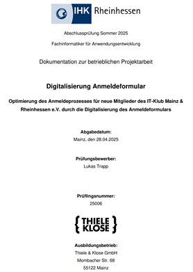
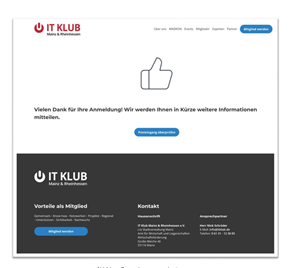
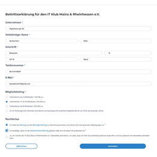
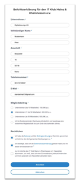

# Digitalisierung Anmeldeformular

**Abschlussprojekt – Fachinformatiker für Anwendungsentwicklung (IHK)**  
Abschlussprüfung Sommer 2025 – IHK Rheinhessen

---

## 📌 Projektübersicht

Im Rahmen meiner Abschlussprüfung zum **Fachinformatiker für Anwendungsentwicklung** wurde der Anmeldeprozess für neue Mitglieder des  
**IT-Klub Mainz & Rheinhessen e.V.** digitalisiert.

Ziel des Projekts war es, den bisherigen papierbasierten bzw. manuellen Prozess durch ein **modernes, responsives Online-Anmeldeformular** zu ersetzen und dadurch Effizienz, Benutzerfreundlichkeit und Datenqualität zu verbessern.

---

## 📄 Projektdokumentation (PDF)

👉 **Klick auf das Thumbnail, um die vollständige Projektdokumentation zu öffnen:**

<p align="left">
  <a href="LukasTrapp_FIA_Dokumentation.pdf">
    
  </a>
</p>

---

## 🖥️ Screenshots

### ✅ Erfolgreiche Anmeldung
<a href="screenshots/member-approved.png">
  
</a>


### 🖥️ Mitgliederformular – Desktop
<a href="screenshots/mitglied-desktop.png">
  
</a>


### 📱 Mitgliederformular – Mobil
<a href="screenshots/mitglied-mobil.png">
  
</a>


## ⚙️ Funktionen

- Digitales Anmeldeformular für neue Mitglieder
- Validierung von Pflichtfeldern
- Responsive Design (Desktop & Mobile)
- DSGVO-konforme Checkboxen (Datenschutz & Satzung)
- Benutzerfreundliche Bestätigungsseite nach erfolgreicher Anmeldung

---

## 🛠️ Technologien & Tools

- HTML / CSS
- JavaScript
- Responsive Webdesign
- Formularvalidierung
- Projektplanung & Dokumentation nach IHK-Vorgaben

---

## 📂 Projektinhalt

```plaintext
├── screenshots/
│ ├── member-approved.png
│ ├── mitglied-desktop.png
│ └── mitglied-mobil.png
│
├── thumbnails/
│ ├── member-approved.png
│ ├── mitglied-desktop.png
│ └── mitglied-mobil.png
│
├── LukasTrapp_FIA_Dokumentation.pdf
└── README.md
```


